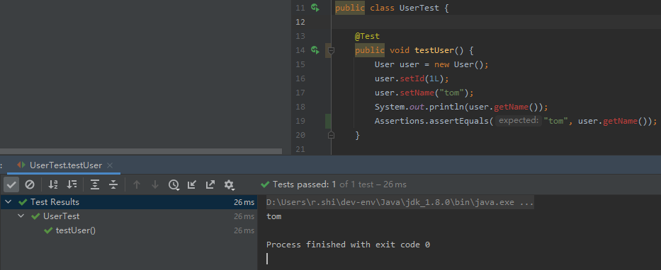

# jsr269-in-action
jsr269 实战


## 项目简介

使用 JSR269 插入式注解实现了Lombok生成Getter/Setter方法的工具。例如：

在实体类上添加`@Data`注解，

```java

import com.ray.study.sample.simple.lombok.annotation.Data;

/**
 * description
 *
 * @author r.shi 2021/5/27 17:16
 */
@Data
public class User {

    private Long id;

    private String name;

}

```

经过编译后会生成Getter/Setter方法

```java
package com.ray.study.sample.simple.lombok.test;

public class User {
    private Long id;
    private String name;

    public void setName(String name) {
        this.name = name;
    }

    public String getName() {
        return this.name;
    }

    public void setId(Long id) {
        this.id = id;
    }

    public Long getId() {
        return this.id;
    }

    public User() {
    }
}

```

然后运行如下测试用例也可通过：




## 运行项目

请参见：[01_如何运行示例项目](./doc/01_如何运行示例项目.md)

