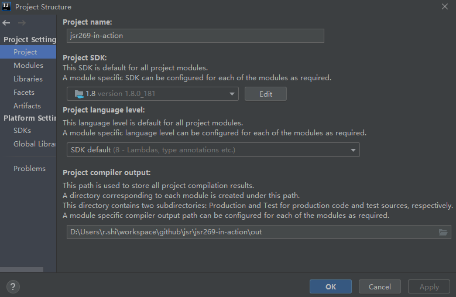

# 如何运行示例项目


[toc]


## 一、运行项目

### 1.环境准备

> - JDK 1.8

本项目只适用于Java 6-Java 8，推荐Java 8，因此需要先配置Java8的环境变量

### 2.Idea配置

将项目克隆到本地，然后导入Idea，接着需要做如下两个配置


#### 2.1 配置项目的Java版本




#### 2.2 设置 编译参数

依次点击 `Settings` -> `Build,Excution,Deployment` -> `Compiler`，然后设置 `Shared build process VM options`为

```properties
-Djps.track.ap.dependencies=false
```

如下图：


### 3.运行项目

#### 3.1 打包项目

先在项目根目录下执行打包命令：

```bash
mvn clean package
```

#### 3.2 执行测试类

直接运行`UserTest`


